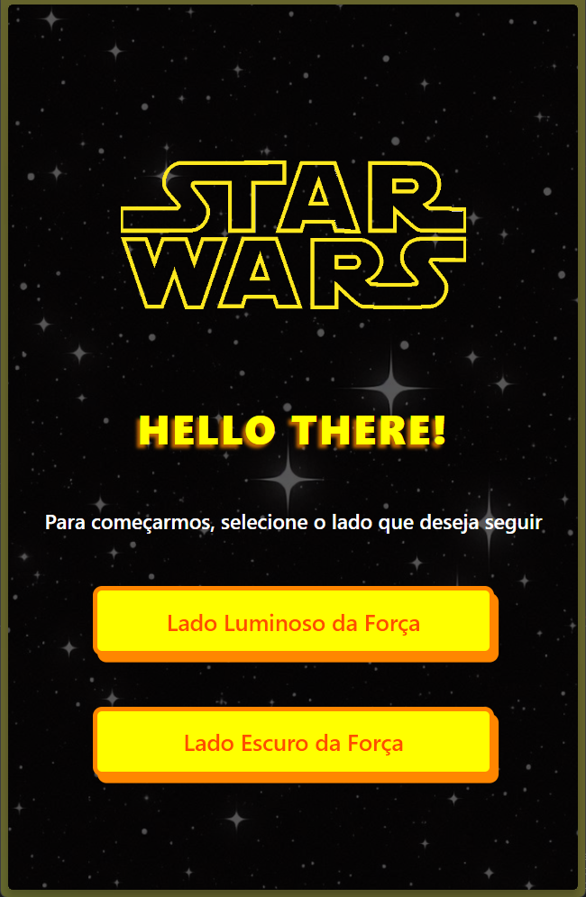
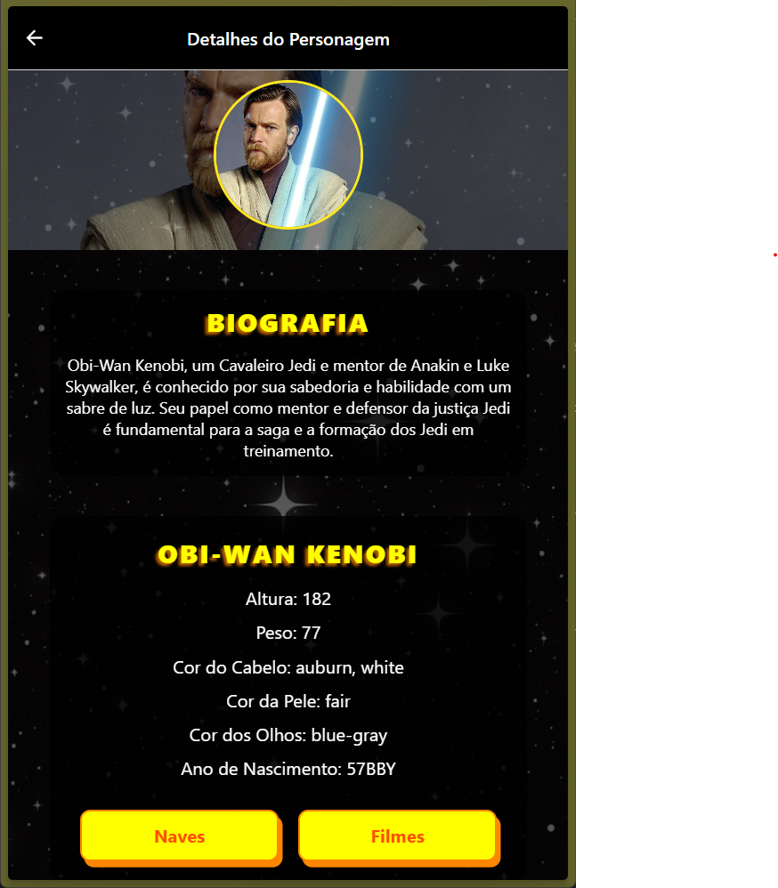

# Star Wars Character Biographies




## Descrição

Esta aplicação React Native apresenta a biografia dos personagens do universo Star Wars. Utilizando a SWAPI (Star Wars API), os dados dos personagens são recuperados e exibidos em uma interface amigável, permitindo aos usuários explorar as informações dos personagens de forma prática e interativa.


---


---

## Funcionalidades

- **Busca de Personagens:** A aplicação consulta a SWAPI para recuperar dados atualizados dos personagens de Star Wars.

- **Exibição de Biografias:** As biografias dos personagens são renderizadas em tela com informações detalhadas.

- **Interface Amigável:** Layout intuitivo e fácil de navegar, proporcionando uma ótima experiência ao usuário.

## Instalação

Siga as etapas abaixo para configurar e executar a aplicação localmente.

### Pré-requisitos

- **Node.js** (versão 12 ou superior)
- **React Native CLI** ou **Expo CLI**
- **Android Studio** (para emulador Android) ou **Xcode** (para emulador iOS)
- Conexão à internet para acesso à SWAPI.

### Passos

1. Clone este repositório:

   ```bash
   git clone https://github.com/rklein7/Projeto-StarWars.git
   cd Projeto-StarWars
   ```

2. Instale as dependências:

   ```bash
   npm install
   ```

3. Execute a aplicação:

   - Utilizando o node:
     ```bash
     npm start
     ```
   - Para Android:
     ```bash
     npx react-native run-android
     ```
   - Para iOS:
     ```bash
     npx react-native run-ios
     ```

## Uso

Ao abrir a aplicação, você será recebido com uma lista de personagens de Star Wars. Ao selecionar um personagem, a biografia completa será exibida, juntamente com detalhes adicionais, como a possibilidade de ver as naves e os filmes em que ele participou, tudo isso carregado de maneira dinâmica pela SWAPI.

## Tecnologias Utilizadas

- **React Native:** Framework para desenvolvimento de aplicações móveis nativas utilizando React.
- **SWAPI:** API REST que fornece dados do universo Star Wars.
  ```
  https://swapi.dev/documentation
  ```
- **Axios:** Para realizar as requisições HTTP.

## Contribuidores

- **Eduardo da Silva Sichelero** RA: 1134933
- **Rafael Klein** RA: 1134933

Este projeto foi desenvolvido como parte da disciplina de **Projeto, Design e Engenharia de Processos**.
